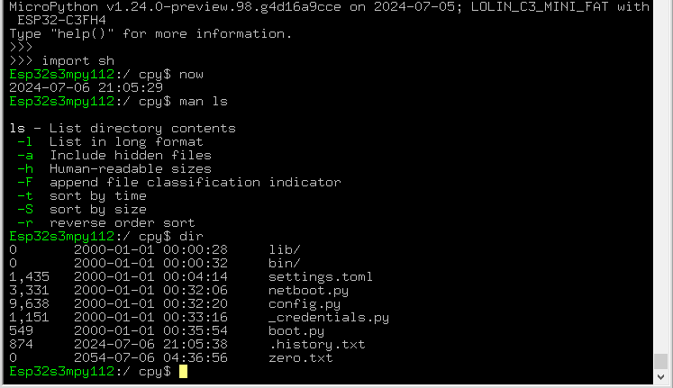

# mpy_shell
Linux-like shell interface for MicroPython.  ( See [cpy_shell](https://github.com/gitcnd/cpy_shell) for the CircuitPython version. )

Inspired by [mipyshell](https://github.com/vsolina/mipyshell) and busybox, here is a command-line shell for your MicroPython board carefully implementing a range of useful commands and features.

Everything is written to save RAM and Flash; command bytecode is not loaded if you don't run the command, history is stored in a file, not in RAM, pipes use flash instead of RAM, command recall and editing and tab-completion is intelligent, etc.

## Installation and running:

* place the .mpy files for your version into /lib/ on your MicroPython device
* run `import sh` from the >>> repl

\>>> ` import sh `

## Supported Commands

### File Management
- `dir` - List directory contents (alias for `ls -Flatr`)
- `cd` - Change directory
- `mv` - Move or rename files or directories (supports -i)
- `ls` - List directory contents (supports -F -l -a -t -r -h -S flags)
- `rm` - Remove files or directories
- `cp` - Copy files or directories (supports -i)
- `pwd` - Print working directory
- `find` - Search for files in a directory hierarchy
- `sort` - Sort lines of text files (supports -r flag)
- `mkdir` - Make directories
- `df` - Report file system disk space usage
- `du` - Estimate file space usage  [**](https://github.com/gitcnd/mpy_shell#user-content-Unimplimented-at-present)
- `rmdir` - Remove empty directories
- `touch` - Change file timestamps or create an empty file

### Text Processing
- `vi` - vim-like Text editor  [**](https://github.com/gitcnd/mpy_shell#user-content-Unimplimented-at-present)
- `nano` - Text editor  [**](https://github.com/gitcnd/mpy_shell#user-content-Unimplimented-at-present)
- `edit` - Text editor  [**](https://github.com/gitcnd/mpy_shell#user-content-Unimplimented-at-present)
- `grep` - Search text using patterns  [**](https://github.com/gitcnd/mpy_shell#user-content-Unimplimented-at-present)
- `cat` - Concatenate and display files
- `tail` - Output the last part of files  [**](https://github.com/gitcnd/mpy_shell#user-content-Unimplimented-at-present)
- `head` - Output the first part of files  [**](https://github.com/gitcnd/mpy_shell#user-content-Unimplimented-at-present)
- `echo` - Display a line of text
- `more` - View file contents page-by-page  [**](https://github.com/gitcnd/mpy_shell#user-content-Unimplimented-at-present)
- `wc` - Word, line, character, and byte count
- `zcat` - Concatenate compressed files and output  [**](https://github.com/gitcnd/mpy_shell#user-content-Unimplimented-at-present)
- `less` - View file contents page-by-page with backward movement (similar to `more`)  [**](https://github.com/gitcnd/mpy_shell#user-content-Unimplimented-at-present)
- `hexedit` - View and edit files in hexadecimal format  [**](https://github.com/gitcnd/mpy_shell#user-content-Unimplimented-at-present)

### System Information
- `history` - Command history
- `uname` - Print system information  [**](https://github.com/gitcnd/mpy_shell#user-content-Unimplimented-at-present)
- `uptime` - Tell how long the system has been running
- `hostname` - Show or set the system's hostname  [**](https://github.com/gitcnd/mpy_shell#user-content-Unimplimented-at-present)
- `date` - Display or set the system date and time
- `whois` - Query domain name information  [**](https://github.com/gitcnd/mpy_shell#user-content-Unimplimented-at-present)
- `env` - Display or set environment variables
- `setenv` - Set environment variables (equivalent of `export` in some contexts)
- `export` - Set environment variables
- `printenv` - Print all or part of the environment
- `diff` - Compare files line by line  [**](https://github.com/gitcnd/mpy_shell#user-content-Unimplimented-at-present)

### Networking Utilities
- `curl` - Transfer data from or to a server
- `wget` - Non-interactive network downloader (alias for `curl`)
- `ping` - Send ICMP ECHO_REQUEST to network hosts
- `dig` - DNS lookup  [**](https://github.com/gitcnd/mpy_shell#user-content-Unimplimented-at-present)
- `ssh` - OpenSSH remote login client  [**](https://github.com/gitcnd/mpy_shell#user-content-Unimplimented-at-present)
- `scp` - Secure copy (remote file copy program)  [**](https://github.com/gitcnd/mpy_shell#user-content-Unimplimented-at-present)
- `telnet` - User interface to the TELNET protocol  [**](https://github.com/gitcnd/mpy_shell#user-content-Unimplimented-at-present)
- `nc` - netcat arbitrary TCP and UDP connections and listens  [**](https://github.com/gitcnd/mpy_shell#user-content-Unimplimented-at-present)
- `ifconfig` - Configure network interfaces  [**](https://github.com/gitcnd/mpy_shell#user-content-Unimplimented-at-present)
- `ftp` - File Transfer Protocol client  [**](https://github.com/gitcnd/mpy_shell#user-content-Unimplimented-at-present)

### Package Management
- `pip` - Package manager - aliases to help with installing   [**](https://github.com/gitcnd/mpy_shell#user-content-Unimplimented-at-present)
- `yum` - Package manager - alias for `pip`  [**](https://github.com/gitcnd/mpy_shell#user-content-Unimplimented-at-present)
- `apt` - Advanced Package Tool - alias for `pip`  [**](https://github.com/gitcnd/mpy_shell#user-content-Unimplimented-at-present)

### File Compression
- `tar` - Archive files  [**](https://github.com/gitcnd/mpy_shell#user-content-Unimplimented-at-present)
- `gzip` - Compress files  [**](https://github.com/gitcnd/mpy_shell#user-content-Unimplimented-at-present)
- `gunzip` - Decompress files  [**](https://github.com/gitcnd/mpy_shell#user-content-Unimplimented-at-present)
- `bzip2` - Compress files  [**](https://github.com/gitcnd/mpy_shell#user-content-Unimplimented-at-present)
- `bunzip2` - Decompress files  [**](https://github.com/gitcnd/mpy_shell#user-content-Unimplimented-at-present)

### Development Tools
- `python` - inbuilt - alias for `run`  [**](https://github.com/gitcnd/mpy_shell#user-content-Unimplimented-at-present)
- `sh` - inbuilt - aliasthis tool itself (you can run commands from a .sh file through this shell)
- `git` - Distributed version control system  [**](https://github.com/gitcnd/mpy_shell#user-content-Unimplimented-at-present)
- `diff` - Compare files line by line  [**](https://github.com/gitcnd/mpy_shell#user-content-Unimplimented-at-present)

### Miscellaneous Utilities
- `locate` - Find files by name  [**](https://github.com/gitcnd/mpy_shell#user-content-Unimplimented-at-present)
- `sz` - Send files (ZModem)  [**](https://github.com/gitcnd/mpy_shell#user-content-Unimplimented-at-present)
- `rz` - Receive files (ZModem)  [**](https://github.com/gitcnd/mpy_shell#user-content-Unimplimented-at-present)
- `now` - Display the current date and time (alias for `date`)  [**](https://github.com/gitcnd/mpy_shell#user-content-Unimplimented-at-present)
- `who` - Show who is logged on  [**](https://github.com/gitcnd/mpy_shell#user-content-Unimplimented-at-present)
- `which` - Locate a command
- `clear` - Clear the terminal screen
- `reboot` - Reboot the system
- `poweroff` - Halt, power-off, or reboot the machine  [**](https://github.com/gitcnd/mpy_shell#user-content-Unimplimented-at-present)
- `passwd` - Change user password  [**](https://github.com/gitcnd/mpy_shell#user-content-Unimplimented-at-present)
- `sleep` - Delay for a specified amount of time
- `unalias` - Remove alias definitions  [**](https://github.com/gitcnd/mpy_shell#user-content-Unimplimented-at-present)
- `alias` - Create an alias for a command  [**](https://github.com/gitcnd/mpy_shell#user-content-Unimplimented-at-present)
- `exit` - Exit the shell
- `help` - Display help information about built-in commands
- `md5sum` - Calculate MD5 checksums  [**](https://github.com/gitcnd/mpy_shell#user-content-Unimplimented-at-present)
- `sha1sum` - Calculate SHA-1 checksums  [**](https://github.com/gitcnd/mpy_shell#user-content-Unimplimented-at-present)
- `sha256sum` - Calculate SHA-256 checksums  [**](https://github.com/gitcnd/mpy_shell#user-content-Unimplimented-at-present)
- `hexedit` - View and edit files in hexadecimal format  [**](https://github.com/gitcnd/mpy_shell#user-content-Unimplimented-at-present)

### Hardware Extensions
- `blink` - flash the device LED  [**](https://github.com/gitcnd/mpy_shell#user-content-Unimplimented-at-present)
- `set` - set the state of a GPIO pin  [**](https://github.com/gitcnd/mpy_shell#user-content-Unimplimented-at-present)
- `pins` - display the input coming in to a GPIO pin  [**](https://github.com/gitcnd/mpy_shell#user-content-Unimplimented-at-present)
- `adc` - display the analogue input from a GPIO  [**](https://github.com/gitcnd/mpy_shell#user-content-Unimplimented-at-present)
- `button` - display the state of the default button  [**](https://github.com/gitcnd/mpy_shell#user-content-Unimplimented-at-present)
- `photo` - take a photo from the device camera  [**](https://github.com/gitcnd/mpy_shell#user-content-Unimplimented-at-present)
- `neo_blink` - set one or more neopixel LED colours  [**](https://github.com/gitcnd/mpy_shell#user-content-Unimplimented-at-present)
- `blink_all_pins` - output pin numbers using TTL 1's and 0's to identify pins (e.g. 7 x 1-0 pulses for GPIO7)  [**](https://github.com/gitcnd/mpy_shell#user-content-Unimplimented-at-present)
- `beep` - send an analogue tone to the default speaker  [**](https://github.com/gitcnd/mpy_shell#user-content-Unimplimented-at-present)
- `freq` - set a specific analogue output to a GPIO pin (e.g. move a servo)  [**](https://github.com/gitcnd/mpy_shell#user-content-Unimplimented-at-present)
####
- `display` - control the screen  [**](https://github.com/gitcnd/mpy_shell#user-content-Unimplimented-at-present)
- `print` - write some text onto the screen  [**](https://github.com/gitcnd/mpy_shell#user-content-Unimplimented-at-present)
- `showbmp` - put a graphic onto the screen  [**](https://github.com/gitcnd/mpy_shell#user-content-Unimplimented-at-present)
- `clearlcd` - erase the LCD screen
####
- `mountsd` - attach an SD card  [**](https://github.com/gitcnd/mpy_shell#user-content-Unimplimented-at-present)
- `umount` - un-attach it  [**](https://github.com/gitcnd/mpy_shell#user-content-Unimplimented-at-present)
####
- `run` - execute a python program from the shell - does progressive-compilation to save space.  [**](https://github.com/gitcnd/mpy_shell#user-content-Unimplimented-at-present)
####
- `espnowreceiver` - show incoming espnow messages  [**](https://github.com/gitcnd/mpy_shell#user-content-Unimplimented-at-present)
- `espnowsender` - send espnow messages  [**](https://github.com/gitcnd/mpy_shell#user-content-Unimplimented-at-present)
####
- `hardreset` - reboot the chip  [**](https://github.com/gitcnd/mpy_shell#user-content-Unimplimented-at-present)
####
- `memtest` - test memory  [**](https://github.com/gitcnd/mpy_shell#user-content-Unimplimented-at-present)
####
- `bluescan` - show visible bluetooth devices and data  [**](https://github.com/gitcnd/mpy_shell#user-content-Unimplimented-at-present)
- `scani2c` - show attached I2C devices found  [**](https://github.com/gitcnd/mpy_shell#user-content-Unimplimented-at-present)
####
- `temperature` - print current temperature  [**](https://github.com/gitcnd/mpy_shell#user-content-Unimplimented-at-present)
- `mag` - show the X, Y, and Z field strength from a magnetometer  [**](https://github.com/gitcnd/mpy_shell#user-content-Unimplimented-at-present)
- `gps` - display your latitude and longitude  [**](https://github.com/gitcnd/mpy_shell#user-content-Unimplimented-at-present)
- `radar` - output data from your attached radar device  [**](https://github.com/gitcnd/mpy_shell#user-content-Unimplimented-at-present)
####
- `telnetd` - listen for terminal input over TCP/IP  [**](https://github.com/gitcnd/mpy_shell#user-content-Unimplimented-at-present)
####
- `wifi` - control your wifi settings  [**](https://github.com/gitcnd/mpy_shell#user-content-Unimplimented-at-present)

## Unimplimented at present

\*\* items above marked [**](https://github.com/gitcnd/mpy_shell#user-content-Unimplimented-at-present) have not yet been written:-

feel free to add them and send me a PR !

new commands live in sh1.py or sh0.py etc as required (we want to keep the .mpy files for each of these libs to <= 4096 bytes to save ram and disk space.)

## Features

### Command History
Implement a command history that allows users to scroll through previously entered commands using the up and down arrow keys (without wasting RAM, and persists across reboots)

### Tab Completion
Add tab completion for command and file and directory names to improve user experience.

#### Piping and Redirection
Basic support for some piping (`|`) and redirection (`>`, `>>`, `<`) to chain commands and redirect input/output.

### Environment Variables
Allow users to set, view, and use environment variables.

### Scripting
Support for easily running Python, using progressive compilation, enabling running larger programs that would not otherwise fit into RAM

### Aliases
Allow users to create command aliases for frequently used commands.

### Help System
Implements a `help` command that provides information about available commands and their usage.

### User Customization
Supports settings.toml for configuration and environment where users can customize their shell experience.

## Notes

* ENVironment variables come from, and write into, `settings.toml`
* /.history.txt accumulates your command history (for up/down arrows and ! etc)
* use ^C to exit back to the python repl \>>>

## Example

